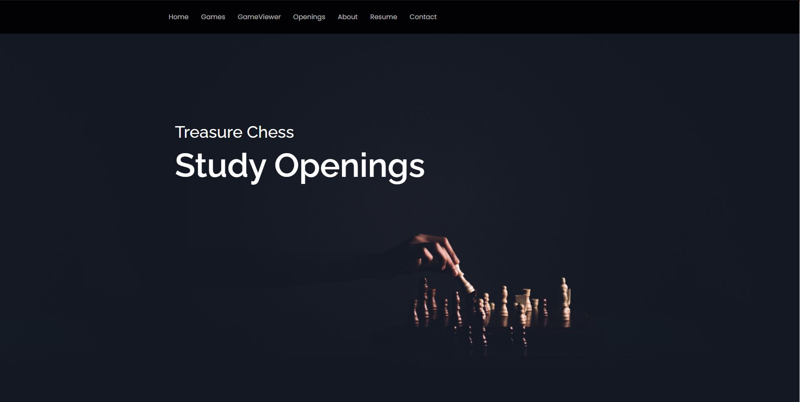

# Welcome to Treasure Chess!
My name is Jack and this is my Chess study website. I made this website because chess is a beautiful and elegant game, yet most of the websites out there look like:
https://www.chessgames.com/perl/chesscollection?cid=1021661
or even this:
https://www.ichess.net/blog/famous-chess-games/

They are great resources, but they don't have the flair of a modern website like:
http://www.mikiyakobayashi.com/

# Where's the data?
This website works in tandem with https://github.com/zhiyi-zhang-duke/treasure-chess-api, where I import PGN files that contain chess games. The treasure-chess flask api runs on port 5000 while this website runs on port 3000

# Tech stack
This is obviously a react application but it also uses Twitter Bootstrap for efficient div organization.
Some fun javascript libraries I use are:
typed.js
chessboard.js
venobox.js

# To dos and Goals
I intend to make Treasure Chess and full fledged chess study tool. In the near future, you should be able to use Treasure Chess to browse favorite games by different metrics such as: player, elo, opening, tournament, etc.
Key features I'm working on now:
Simple interface for replaying a chess game
An openings page that organizes games by opening, to help chess players quickly view famous games from the opening that they're studying/practicing
A players page that organizes games by player
Stockfish engine evaluation
